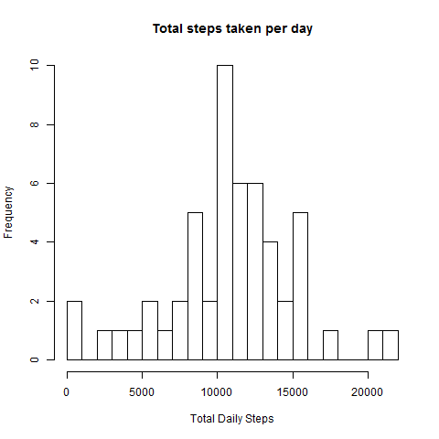
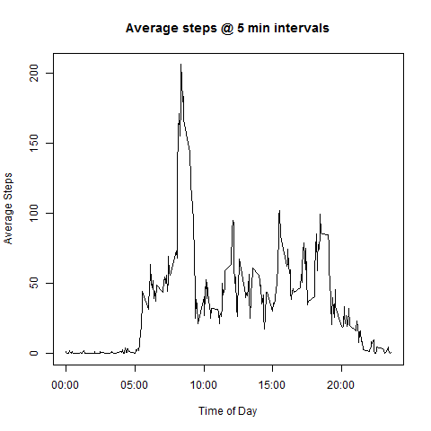
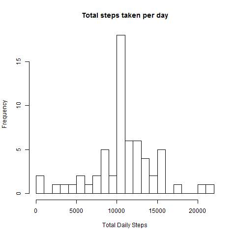
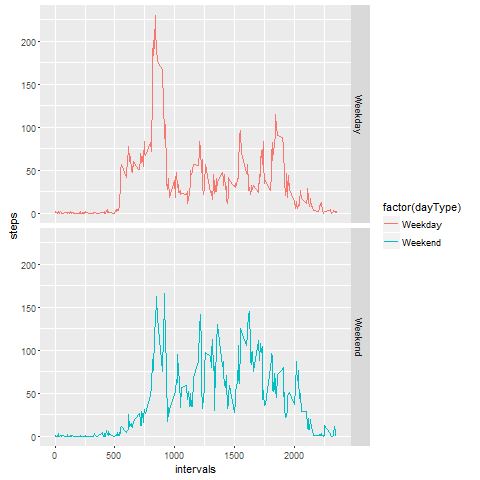

# Reproducible Research: Peer Assessment 1


## Loading and preprocessing the data

1. Load the data
2. Process the data into a format suitable for your analysis

```r
#This function loads the data into a dataframe, and adds a factor column for the intervals values
loadActivityDF = function(){
  if (!exists("activityDF"))
  {
    message("Loading new data table")
    if (!file.exists("activity.csv"))
    {
      message("Unzipping source file")
      unzip("activity.zip")
    }
    activityDF = read.csv("activity.csv")
    activityDF$intervals = as.factor(as.character(activityDF$interval))
  }
  else {message("Using cached data")}
  
  activityDF
}
```

## What is mean total number of steps taken per day?
1. Make a histogram of the total number of steps taken each day

```r
#This function aggregates the step data into a "per day" step count, and creates (and saves) a histogram of the resulting data.
summarizeSteps = function(dataset, fileName){
  summarySteps = aggregate(steps~date, data=dataset, sum, na.rm=TRUE)
  png(file=paste(".\\figures\\", fileName, ".png", sep=""), width=480, height=480)  
  hist(summarySteps$steps, breaks=20, xlab="Total Daily Steps", main="Total steps taken per day")
  dev.off()
  summarySteps
}
```



2. Calculate and report the __mean__ and __median__ total number of steps taken per day

```r
#This function calculates the mean number of steps taken per day
meanDailySteps = function(dataset){
  
  meanSteps = mean(dataset$steps, na.rm = TRUE)

  meanSteps
}

#This function calculates the median number of steps taken per day
medianDailySteps = function(dataset){
  medianSteps = median(dataset$steps, na.rm = TRUE)
  
  medianSteps
}
```
*The mean number of steps was 10766 steps.  
*The median number of steps was 10765 steps.

## What is the average daily activity pattern?
1.  Make a time series plot of the 5-minute interval(x-axis) and the average number of steps taken, averaged across all days (y-axis)

```r
#This function calculates the mean number of steps for each time interval, across all days in the study.  It then produces (and saves) a line plot of the data
plotIntervalSteps = function(dataset, fileName){
  meanIntervalSteps = aggregate(steps~intervals, data=dataset, mean, na.rm=TRUE)
  intervals = data.frame(intervals=as.numeric(levels(dataset$intervals)), meanIntervalSteps)
  intervals = intervals[order(intervals$intervals), ]
  
  labels = c("00:00", "05:00", "10:00", "15:00", "20:00")
  labels.at = seq(0, 2000, 500)
  png(file=paste(".\\figures\\", fileName, ".png", sep=""), width=480, height=480)  
  plot(intervals$intervals, intervals$steps, type="l", main="Average steps @ 5 min intervals",
       ylab = "Average Steps", xlab = "Time of Day", xaxt = "n")
  axis(side = 1, at = labels.at, labels = labels)
  dev.off()
  intervals
}
```


2. Which 5 minute interval, on average across all the days in the database, contains the maximum number of steps?

```r
#This function calculates the time interval that has the highest average step count, across all days of the study
maxIntervalSteps = function(dataset){
  sortedIntervalSteps = dataset[order(dataset$steps, decreasing = TRUE), ]
  maxIntervalSteps = sortedIntervalSteps$intervals[1]
  maxIntervalSteps
}
```
_The 5-minute interval corresponding to the highest average number of steps is 835, which is the time interval from 8:35am to 8:40am_

## Imputing missing values
1. Calculate and report the total number of missing values (coded as NA)

```r
#This function calculates the number of missing step values (i.e. "NA" in source data) across all days and intervals in the study
calculateMissingData = function(dataset){
  dim(dataset[is.na(dataset$steps), ])[1]
}
```
There are 2304 rows with a missing step count

2. Devise a strategy for filling in all of the missing values in the dataset. The strategy does not need to be sophisticated.
_For this assignment, the mean step value (over all days of the study) for intervals that were missing data was used to imput a value._

3. Create a new dataset that is equal to the original dataset but with the missing values filled in

```r
#This function will imput the mean step count for a given interval in all cases where a step count is missing.  
#This value was chosen as the best way to reduce the calculation bias.  
#This function also calculates the day type (Weekend or Weekday) of each day in the study for
#futher reporting breakdowns
imputMissingData = function(dataset, intervalDF){
  completeData = dataset
  
  for (i in 1:dim(dataset)[1]){
    if(is.na(dataset$steps[i])) {
      completeData$steps[i] = intervalDF$steps[intervalStepsDF$intervals == dataset$interval[i]] 
    }
  }
  completeData$dayType = as.factor(c("Weekend", "Weekday", "Weekday", 
                           "Weekday", "Weekday", "Weekday", "Weekend")[as.POSIXlt(completeData$date)$wday + 1])
  
  completeData
}
```

4. Make a histogram of the total number of steps taken each day and Calculate and report the mean and median total number of steps taken per day. Do these values differ from the estimates from the first part of the assignment? What is the impact of imputing missing data on the estimates of the total daily number of steps? 

```r
#This function aggregates the step data into a "per day" step count, and creates (and saves) a histogram of the resulting data.
summarizeSteps = function(dataset, fileName){
  summarySteps = aggregate(steps~date, data=dataset, sum, na.rm=TRUE)
  png(file=paste(".\\figures\\", fileName, ".png", sep=""), width=480, height=480)  
  hist(summarySteps$steps, breaks=20, xlab="Total Daily Steps", main="Total steps taken per day")
  dev.off()
  summarySteps
}
```


Using the same meanDailySteps and medianDailySteps functions on the completed data, we can determine that the mean and median values are 10766 and 10766, respectively.  Therefore, the mean value is unchanged, but the median value increased by 1.

## Are there differences in activity patterns between weekdays and weekends?

1.  Create a new factor variable in the dataset with two levels -- "weekday" and "weekend" indicating whether a given date is a weekday or weekend day.
_See Item 3 above_

2.  Make a panel plot containing a time series plot (i.e.  type = "l" ) of the 5-minute interval (x-axis) and the average number of steps taken, averaged across all weekday days or weekend days (y-axis). 

```r
#This function calculates the mean number of steps based on the intervals and day type (weekday or weekend)
#The resulting data is plotted (and saved) in a two panel line graph to show the difference
plotDayType = function(dataset, fileName){
  library(ggplot2)
  meanIntervalSteps = aggregate(steps~intervals+dayType, data=dataset, mean)
  intervals = data.frame(intervals=as.numeric(levels(dataset$intervals)), meanIntervalSteps)
  intervals = intervals[order(intervals$intervals), ]
  
  png(file=paste(".\\figures\\", fileName, ".png", sep=""), width=480, height=480)  
  plot = ggplot(data=intervals, aes(x=intervals, y = steps, colour = factor(dayType)), environment = environment())
  plot = plot + geom_line() 
  plot = plot + facet_grid(dayType ~ .)
  
  print(plot)
  dev.off()
}
```


##Code used to process the above functions

```r
message("Starting processing")
```

```
## Starting processing
```

```r
activityDF = loadActivityDF()
```

```
## Loading new data table
```

```r
summaryDF = summarizeSteps(activityDF, "rawHistogram")
meanSteps = meanDailySteps(summaryDF)
medianSteps = medianDailySteps(summaryDF)
intervalStepsDF = plotIntervalSteps(activityDF, "intervalSteps")
maxInterval = maxIntervalSteps(intervalStepsDF)
countMissingData = calculateMissingData(activityDF)
completeDataDF = imputMissingData(activityDF, intervalStepsDF)
completeSummaryDF = summarizeSteps(completeDataDF, "completeHistogram")
meanCompleteSteps = meanDailySteps(completeSummaryDF)
medianCompleteSteps = medianDailySteps(completeSummaryDF)
plotDayType(completeDataDF, "intervalStepsByDayType")
```

```
## png 
##   2
```

```r
message("Processing complete")
```

```
## Processing complete
```
